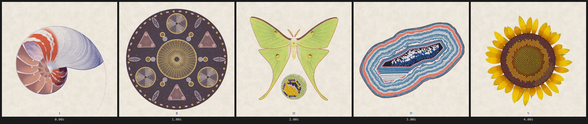
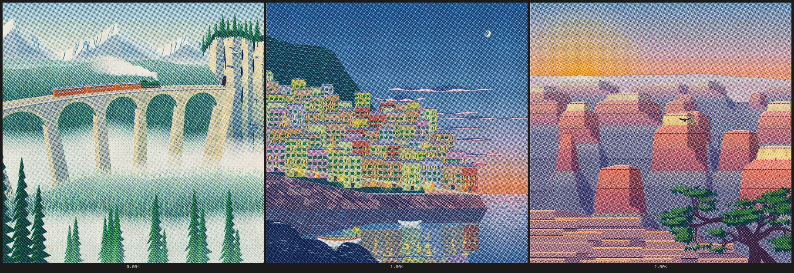

# riso-windowseat

Procedural risograph films and prints, each a single `index.html` of Canvas 2D and Web Audio:
no libraries, fonts, images or network calls. The repo began as the release of **Window Seat**.
Making it, and the two shorts before it, produced a reusable kit of Claude Code skills, craft
docs and a render harness. Roost, Held and Nonpareil were made with it next, and two print
series, Cabinet and Sceneries.


## Films

All are 1080 × 1080, 30 fps. MP4s are on the
[v1.0 release](https://github.com/sevenevesai/riso-windowseat/releases/tag/v1.0). To watch the
source instead, open any `index.html` in a browser and press play.

| Film | Length | |
|---|---|---|
| [Window Seat](films/window-seat/) | 78 s | A night train journey through one window, scored for piano |
| [Roost](films/roost/) | 70 s | One take of a starling murmuration from sunset to roost, scored for strings |
| [Held](films/held/) | 70 s | A kite that flies only while something holds its line, scored for found instruments |
| [Nonpareil](films/nonpareil/) | 70 s | Paper marbling from the first drop to the one print it makes, scored for handpan |
| [Lumen](films/lumen/) | 28 s | A seed that contains a sun; the first short, in call-and-response form |
| [Emergence](films/emergence/) | 28 s | Lumen's sibling: how machines learned to listen, as nine worlds |

### Window Seat

A night train journey seen through one fixed window with a glass of water on the sill. Every
pixel and every sound except the piano is procedural.

| Time | Passage |
|---|---|
| 0–19 s | Golden departure from a platform, fields, a red truss bridge, a conifer cutting, a tunnel |
| 19–38 s | A night city with a canal and a level crossing; another train overtakes, passengers in its windows |
| 38–57 s | Fireworks over a lake, sleeper hours with star trails, pre-dawn fog |
| 57–78 s | Dawn from a viaduct, rain streaming back along the glass, a lakeside halt under a rainbow |

The score, "A Light Left in the Window", is an original piano piece in 6/8 whose phrasing follows
the picture's timeline. The glass of water leans with every acceleration and is the last thing to
settle.


### Roost

A murmuration over a marsh in one fixed view. Each starling is a 2–3 px ink dot, so the flock
is the halftone: where the sheet turns edge-on, the birds pile into dark printed ribbons. A
falcon stoops through it and the flock pours into the reeds at nightfall. The string score is
timed from the picture.

### Held

A paper kite's line frays and parts at a hillside stake. Loose, it can only tumble; it falls
across a harbour town, is snagged for a moment by a church weathervane, and over the water its
line catches on a sloop's forestay, so the kite climbs again, held by the boat sailing into
dusk. Its tail and loose line are simulated ropes. The score uses CC0 mbira, harp, glockenspiel,
chimes, strings and flute, with every cue read from the picture's events.

### Nonpareil

Paper marbling seen straight down into the bath. Drops of colour land on the beat and push each
other outward; a rake and a fine comb drag them into the nonpareil pattern, and a flower is
dropped and pulled into the middle. A sheet unrolls across the bath, is peeled back toward the
lens like a turning page, and lands face up and mirrored beside the emptied tray. The marbling
is closed-form geometry, so every frame is exact. The drops are the handpan's notes, over a
slow cello and contrabass line.

## Prints

Still series driven like a film (each integer time is one print) and exported as native
2160 × 2160 PNGs with `tools/still.mjs`.

**[Cabinet](prints/cabinet/)**: five plates from an imaginary natural-history cabinet (a sectioned
nautilus, arranged diatoms, a luna moth, a cut agate, a sunflower), each built from its own growth
geometry and cut as fine line over screened colour.



**[Sceneries](prints/sceneries/)**: a curved viaduct in fog, a cliff village at dusk over its own
reflection, and a stepped canyon at sunrise.



## How they're made

I directed each work; Claude Code (Anthropic's coding agent) wrote the code, using the skills,
rules and docs in this repo. A work is designed in its `FILM.md` or `PRINT.md`, its hardest frame
is proved first, and then it is inspected as frame strips, 1:1 crops and loudness sheets rendered
by `tools/`. Every frame is a pure function of time (`seek(t)`), so any moment can be inspected
exactly and the MP4 cannot drop frames. Each record keeps the design decisions and measurements,
and lists the work's remaining weaknesses.

## Make your own

```
git clone https://github.com/sevenevesai/riso-windowseat
cd riso-windowseat/tools
npm install && npm run setup && npm test
```

Then open Claude Code in the repo root and ask, for example:

- "Make a 40 second riso film of a lighthouse keeper's night."
- "Make a riso poster of a heron on a pier at dusk."
- "Score this film" or "The rain at 66 s is too loud."
- "Extend Window Seat with a snowy mountain pass after the lake."

`CLAUDE.md` gives the session the contract and commands. The `riso-film`, `riso-still` and
`riso-score` skills in `.claude/skills/` carry the workflow and gates. Each skill's `examples.md`
points to the routines in the shipped films that are worth reusing. A hook warns when an edit
breaks determinism.

## What's inside

| Path | Contents |
|---|---|
| `films/` | The six films, each with its `FILM.md`; Window Seat, Roost, Held and Nonpareil include sample credits and bank rebuild scripts |
| `prints/` | Three print series: Cabinet and Sceneries with their `PRINT.md`, and Workings, which donates the print kit new works start from |
| `docs/` | The craft: brief, visual development, drawing, figures, scene space, motion, live plates, sound, quality bar |
| `studies/` | Interactive A/B studies of each technique, and the sound kit |
| `tools/` | Scaffolding, verification, contact sheets, audio analysis and MP4 export ([README](tools/README.md)) |
| `.claude/` | Skills, the ink-plate rule and the determinism hook |

## License

MIT, see [LICENSE](LICENSE). The piano recordings embedded in Window Seat are Salamander Grand
Piano V3 by Alexander Holm under CC BY 3.0; see
[`AUDIO-SOURCES.md`](films/window-seat/AUDIO-SOURCES.md). The string recordings embedded in
Roost are VSCO 2 Community Edition by Versilian Studios under CC0 1.0; see
[`AUDIO-SOURCES.md`](films/roost/AUDIO-SOURCES.md). Held's instruments are from Versilian's VCSL
and VSCO 2, also CC0 1.0; see [`AUDIO-SOURCES.md`](films/held/AUDIO-SOURCES.md). Nonpareil's
handpan is GAMEDRIX974's HandPan pack on Freesound and its cello and contrabass are from VSCO 2,
all CC0 1.0; see [`AUDIO-SOURCES.md`](films/nonpareil/AUDIO-SOURCES.md).
